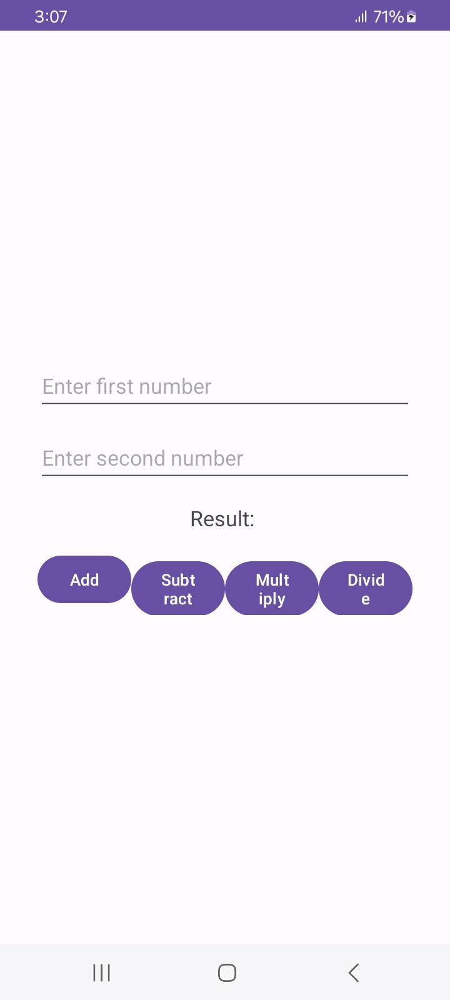
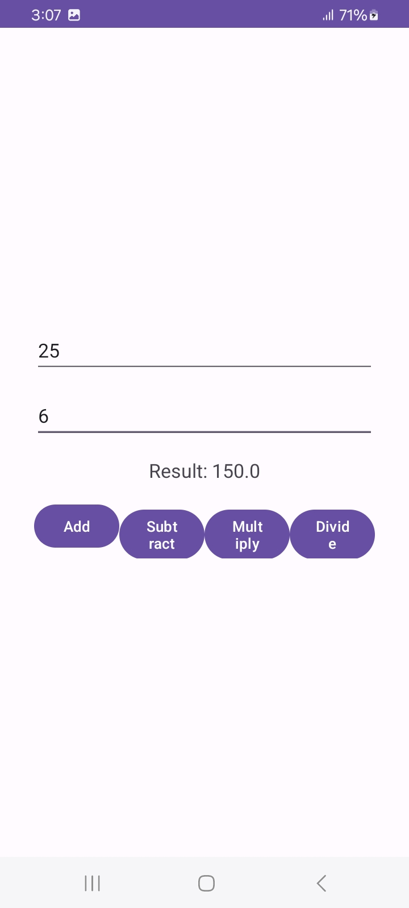

# Calculator Android App

This is a simple calculator Android application built using Java in Android Studio. The app provides basic arithmetic operations such as addition, subtraction, multiplication, and division.

## Features

- **Basic Arithmetic Operations**: Add, subtract, multiply, and divide.
- **Clear Function**: Easily reset the current calculation.
- **User-Friendly Interface**: Simple and intuitive UI for quick calculations.
- **Responsive Design**: Works on both smartphones and tablets.

## Screenshots

        

## Installation

1. Clone this repository:
    ```bash
    git clone https://github.com/AdityaSrivastavDS/Calculator(Android App)
    ```
2. Open the project in Android Studio.
3. Build and run the app on your device or emulator.

## Usage

- Enter numbers using the on-screen keypad.
- Perform operations by tapping on the corresponding operator buttons (`+`, `-`, `×`, `÷`).
- View the result in the display area.
- Use the `C` button to clear the input and start a new calculation.

## Requirements

- Android Studio
- Android SDK version 23 or higher

## Contributing

Feel free to submit issues or pull requests if you have any improvements or bug fixes.

## License

This project is licensed under the MIT License. See the [LICENSE](LICENSE) file for details.
